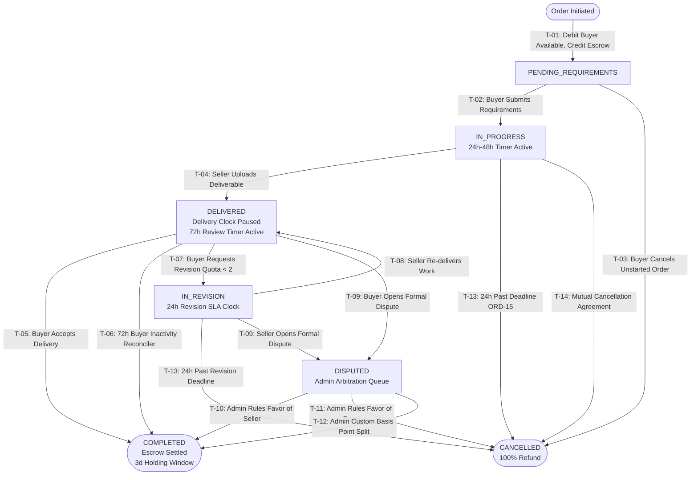

<div align="center">

# ⚡ MicroGig

### High-Velocity Escrow-Backed Micro-Freelance Marketplace: Service-as-a-Product (SaaP), Double-Entry Financial Ledger, Deterministic Order State Machine, 5-Step Gig Wizard, and S3 Asset Protection Pipeline.

[](#tests-and-checks)
[](#tests-and-checks)
[](#pillar-2-strict-double-entry-escrow-ledger--automated-settlement)
[](#pillar-3-deterministic-order-state-machine--concurrency-control)
[](#pillar-4-s3-asset-pipeline--watermarked-preview-security)
[](#pillar-6-identity-session-revocation--operational-security)
[](LICENSE)

MicroGig eliminates the frictional overhead of traditional freelance platforms. Modern freelance networks subject buyers and sellers to lengthy proposal-writing cycles, ambiguous scoping, variable hourly rates, and prolonged settlement delays. By enforcing the **Service-as-a-Product (SaaP)** paradigm, MicroGig transforms creative, technical, and operational services into clearly demarcated, off-the-shelf SKU deliverables—**strictly under $50, delivered within 24 to 48 hours, and backed by mathematical double-entry escrow**.

```
  ┌────────────────────────────────────────────────────────────────────────┐
  │   BROWSE CATALOG  ──►  1-CLICK ESCROW  ──►  24-48H WORKSPACE CLOCK    │
  │   (Fixed < $50)        (Double-Entry)       (Auto-Complete 72h SLA)    │
  │                                                                        │
  │   WATERMARKED PREVIEW  ──►  INSTANT ACCEPT  ──►  3-ENTRY SETTLEMENT   │
  │   (S3 Policy & Tree)        (Optimistic 409)     (Zero-Sum Invariant)  │
  └────────────────────────────────────────────────────────────────────────┘
```

**Fixed price under $50. Turnaround in 24–48 hours. Zero bidding. Zero proposals. Automated double-entry escrow.**

[Live Web App (Demo)](http://localhost:3000) · [Production Deployment Guide](DEPLOYMENT.md) · [Manage Orders Workspace](/orders) · [Seller Onboarding & Wizard](/seller/dashboard) · [Binding PRD Specification](PROJECT_REQUIREMENTS_DOCUMENT.md)

**Service-as-a-Product (SaaP) — Instant Checkout, Deterministic Order Transitions, and Zero-Drift Financial Accounting.**

Next.js 14 App Router · Fastify · TypeScript · PostgreSQL 16 · Drizzle ORM · BullMQ & Redis · MinIO / AWS S3 · Sharp · Tailwind CSS

</div>

> **Mathematical financial and operational integrity.** MicroGig enforces double-entry zero-sum ledger invariants ($\sum \text{amount} = 0$) at transaction commit time via PostgreSQL deferred constraint triggers. Order transitions utilize atomic optimistic concurrency locking to prevent state race conditions. Deliverable assets remain shielded via server-signed S3 pre-signed upload policies, magic-byte inspection, and automated Sharp watermarking—never exposing raw deliverable URLs to buyers prior to completion.

---

## Explore the platform

Test the entire marketplace lifecycle directly across pre-configured demo and production-ready routes:

| Open | Look for | What it establishes |
| :--- | :--- | :--- |
| [Marketplace Catalog (`/gigs`)](/gigs) | Multi-facet Category/Subcategory Filter, Search, Sort | Instant browsing of fixed-price micro-tasks ($5–$50) with 24h/48h turnaround badges |
| [Gig Detail & Order Entry (`/gigs/[slug]`)](/gigs/i-will-fix-1-responsive-css-or-layout-bug-a8f9) | Media Gallery, FAQ Accordion, Seller Card, Sticky CTA | Rich gig presentation, computed seller credibility statistics, and 1-click escrow checkout |
| [5-Step Gig Wizard (`/seller/gigs/new`)](/seller/gigs/new) | Overview → Pricing → Description → Requirements → Gallery | Enforces 80-character "I will..." title constraints, revision quotas, and gallery uploads |
| [Order Workspace (`/orders/[id]`)](/orders/84920) | Order Status Stepper, SLA Countdown Timer, Deliverables Panel | Full buyer/seller collaboration workspace with file review, watermarked previews, and messaging |
| [Manage Orders 7-Tab Dashboard (`/orders`)](/orders) | Priority, Active, Late, Delivered, Completed, Cancelled, Starred | Centralized order management featuring computed `is_late` alerts and 24h late delivery buyer remedies |
| [Financial Wallet & Ledger (`/wallet`)](/wallet) | Available Funds, Pending Clearance, In Active Orders, Lifetime Gross | Real-time double-entry escrow balance summary and printable/exportable CSV transaction history |
| [Seller Dashboard & Onboarding (`/seller/dashboard`)](/seller/dashboard) | 4-Step Onboarding Checklist, Headline Performance Metrics | Gated publishing workflow (Profile → ID Verification → Gig Creation → Publish) and live analytics |
| [Async Messaging Inbox (`/inbox`)](/inbox) | Order-scoped Message Threads & Anti-Leakage Banner | 15s polling async communication with anti-disintermediation regex warning prompts |
| [Account & Session Security (`/settings/security`)](/settings/security) | Active Sessions List, Device Telemetry, Remote Revoke | State-backed `sessions` table tracking with instant "Log Out Everywhere" token revocation |
| [Admin Trust & Safety (`/admin/verifications`)](/admin/verifications) | ID Verification Queue & Dispute Arbitration Console | Manual verification gating and atomic multi-option order dispute settlement |
| [Live Backend Health (`/api/v1/health`)](/api/v1/health) | Service uptime, database connectivity, and timestamp | Fastify REST API health check endpoint for container and cluster monitoring |

---

## Contents

- [Why MicroGig exists](#why-microgig-exists)
- [How it works](#how-it-works)
- [Core architectural invariants & order state machine](#core-architectural-invariants--order-state-machine)
- [6-Pillar core architectural subsystems](#6-pillar-core-architectural-subsystems)
  - [Pillar 1: High-Velocity Fixed-Price Gig Engine & 5-Step Wizard](#pillar-1-high-velocity-fixed-price-gig-engine--5-step-wizard)
  - [Pillar 2: Strict Double-Entry Escrow Ledger & Automated Settlement](#pillar-2-strict-double-entry-escrow-ledger--automated-settlement)
  - [Pillar 3: Deterministic Order State Machine & Concurrency Control](#pillar-3-deterministic-order-state-machine--concurrency-control)
  - [Pillar 4: S3 Asset Pipeline & Watermarked Preview Security](#pillar-4-s3-asset-pipeline--watermarked-preview-security)
  - [Pillar 5: Contextual Messaging, Anti-Leakage Mesh & Notification System](#pillar-5-contextual-messaging-anti-leakage-mesh--notification-system)
  - [Pillar 6: Identity, Session Revocation & Operational Security](#pillar-6-identity-session-revocation--operational-security)
- [Taxonomy & standardized micro-service catalog](#taxonomy--standardized-micro-service-catalog)
- [System interface & API reference](#system-interface--api-reference)
- [What is implemented](#what-is-implemented)
- [Performance & full-stack optimizations](#performance--full-stack-optimizations)
- [Monorepo architecture & deployments](#monorepo-architecture--deployments)
- [Run locally](#run-locally)
- [Tests and checks](#tests-and-checks)
- [Engineering decisions](#engineering-decisions)
- [Technology stack](#technology-stack)
- [Repository map](#repository-map)
- [Trust boundaries and limitations](#trust-boundaries-and-limitations)
- [Official documentation & references](#official-documentation--references)

---

## Why MicroGig exists

Traditional freelance platforms (Upwork, Fiverr, Freelancer) suffer from three fatal structural inefficiencies:

1. **The Proposal Choke & Negotiation Friction**: Buyers must craft detailed job posts, evaluate dozens of vague bids, and negotiate scope and hourly rates. Sellers waste hours writing unbillable proposals.
2. **Ambiguous Scoping & Unbounded Scope Creep**: Vaguely defined tasks spiral into protracted dispute cycles, endless revision demands, and missed delivery expectations.
3. **Escrow Vulnerabilities & Settlement Delays**: Legacy marketplaces rely on opaque ledger accounting where escrow balance drift, uncollected fees, and manual dispute delays erode user trust and tie up working capital for weeks.

| Role | Traditional Freelance Platforms | MicroGig Platform (Our Thesis) |
| :--- | :--- | :--- |
| **Buyer / Client** | Sorts through 20+ proposals; navigates complex 3-tier packages; waits 5–14 days | **Instant 1-click checkout** for standardized micro-tasks ($5–$50); 24–48h delivery guaranteed |
| **Seller / Freelancer** | Writes custom pitches; bids down hourly rates; suffers scope creep | **Service-as-a-Product**: packages exact skills into discrete SKUs with strict 2-revision limits |
| **Trust & Safety Admin** | Arbitrates subjective hourly disputes and off-platform chargebacks | **Objective deliverable verification**: audit events, hash verification, and 1-click ledger settlement |
| **Financial Ledger** | Single-bucket balance math vulnerable to balance drift and escrow leaks | **Mathematical double-entry ledger** with PostgreSQL deferred zero-sum triggers ($\sum = 0$) |

```
                       TRADITIONAL FREELANCE (SLOW & AMBIGUOUS)
  Post Job ──► Receive 25 Bids ──► Negotiate Price ──► Milestone 1 ──► Revision Dispute ──► 14+ Days
                                          VS
                           MICROGIG (HIGH-VELOCITY SaaP)
  Browse SKU ──► 1-Click Escrow ──► Fill Brief ──► Deliverable (24h) ──► Instant Release ──► Done!
```

---

## How it works

MicroGig coordinates buyer ordering, structured requirement submission, deliverable verification, and atomic escrow settlement via an event-driven workflow:

```mermaid
sequenceDiagram
    autonumber
    actor Buyer
    actor Seller
    participant Web as Next.js Web App
    participant API as Fastify API Gateway
    participant DB as PostgreSQL
    participant Ledger as Double-Entry Ledger
    participant S3 as S3 / MinIO Storage
    participant Cron as Reconciler & Cron

    Buyer->>Web: Select Gig ($35.00) & Click "Order Now"
    Web->>API: POST /api/v1/orders { gigId, idempotencyKey }
    rect rgb(240, 248, 255)
    Note over API,Ledger: Atomic Escrow Hold Transaction
    API->>DB: Check Buyer USER_AVAILABLE >= $35.00
    API->>Ledger: Insert Balanced Entries: BUYER_AVAILABLE (-$35), ESCROW (+$35)
    API->>DB: Insert Order (PENDING_REQUIREMENTS) & Emit ORDER_PLACED Event
    end
    API-->>Web: 201 Created { orderId }
    Web->>Buyer: Redirect to /orders/[id] (Prompt Form)
    Buyer->>Web: Submit Required Answers
    Web->>API: POST /api/v1/orders/[id]/requirements { answers }
    API->>DB: Update Status: IN_PROGRESS (Activate 24h Countdown Timer)
    API-->>Seller: Notify: New Order In Progress

    Note over Seller,Web: Seller Works on Deliverable
    Seller->>Web: Click "Deliver Work"
    Web->>API: POST /api/v1/deliveries/presign-upload { filename, contentType, fileSize }
    API-->>Web: Signed S3 Policy { fileKey: "deliveries/ord_123/uuid/patch.zip" }
    Web->>S3: Direct Upload Binary (Max 50 MB, Enforces Type & Size)
    Web->>API: POST /api/v1/orders/[id]/deliveries { fileKey, notes }
    API->>DB: Update Status: DELIVERED (Pause Delivery Clock; Start 72h Review SLA)

    alt Scenario A: Buyer Accepts Delivery
        Buyer->>Web: Review Delivery Notes, Checksum & File Tree / Watermark
        Buyer->>Web: Click "Accept & Complete Order"
        Web->>API: POST /api/v1/orders/[id]/complete (Optimistic Lock WHERE status = 'DELIVERED')
        rect rgb(240, 255, 240)
        Note over API,Ledger: Atomic 3-Entry Escrow Settlement
        API->>Ledger: Debit ESCROW (-$35)
        API->>Ledger: Credit SELLER_PENDING (+$28.00) [80% Net]
        API->>Ledger: Credit PLATFORM_REVENUE (+$7.00) [20% Fee]
        end
        API->>DB: Update Status: COMPLETED
        API-->>Web: Status: COMPLETED (Unlocks Raw Download Link)
        Web->>Buyer: Display 1-5 Star Rating & Review Modal
    else Scenario B: Buyer Inactivity (72 Hours Elapsed)
        Cron->>API: 5-Minute Reconciler finds auto_complete_at <= NOW()
        API->>Ledger: Execute Exact Same 3-Entry Escrow Settlement
        API->>DB: Update Status: COMPLETED (Actor: System)
    end
```

---

## Core architectural invariants & order state machine



### Architectural Invariant Matrix (PRD v1.1 vs Broken Industry Standards)

| System Concern | Legacy / Broken Implementation | MicroGig Architectural Standard |
| :--- | :--- | :--- |
| **Ledger Invariant** | Unbalanced entries credit escrow without debiting buyer, causing balance drift | **Strict 5-Kind Account Model & PostgreSQL Deferred Trigger**: Asserts $\sum \text{amount} = 0$ on every transaction before commit. |
| **Escrow Auto-Completion** | Background auto-completion credits seller balance while omitting escrow debit | **Unified 3-Entry Settlement**: Debits `ESCROW`, credits `SELLER_PENDING`, credits `PLATFORM_REVENUE` atomically. |
| **Asset URL Security** | API returns raw S3 object URLs to buyers during the review phase | **Asset Shielding**: Only watermarked previews or sanitized file trees are rendered until order reaches `COMPLETED`. |
| **File Upload Policies** | Client supplies arbitrary target S3 URLs and unverified byte streams | **Server-Generated S3 Policies**: Strict server-enforced key paths (`deliveries/{orderId}/{uuid}`), 50 MB cap, and magic bytes. |
| **State Machine Concurrency** | Naive `UPDATE orders SET status = ?` causing race conditions between buyer and cron | **Optimistic Concurrency Locking**: `UPDATE ... WHERE id = ? AND status = ? RETURNING *` returning `409 Conflict` on contention. |
| **Session Invalidation** | Stateless JWT claims with no real-time server revocation capabilities | **Server-Backed `sessions` Table**: Tracks IP, UA, and revocation state; supports instant remote "Log Out Everywhere". |
| **Disintermediation** | Free-form messaging allows buyers and sellers to poach off-platform | **Non-Blocking Regex Scanner**: Flags email, phone, Telegram, WhatsApp, and PayPal links with persistent warning banners. |

---

## 6-Pillar core architectural subsystems

```
┌────────────────────────────────────────────────────────────────────────┐
│                 MICROGIG 6-PILLAR ARCHITECTURAL SUBSYSTEMS             │
├────────────────────────────────────────────────────────────────────────┤
│ Pillar 1: High-Velocity Fixed-Price Gig Engine & 5-Step Wizard         │
│ Pillar 2: Strict Double-Entry Escrow Ledger & Automated Settlement     │
│ Pillar 3: Deterministic Order State Machine & Concurrency Control      │
│ Pillar 4: S3 Asset Pipeline & Watermarked Preview Security             │
│ Pillar 5: Contextual Messaging, Anti-Leakage Mesh & Notification System│
│ Pillar 6: Identity, Session Revocation & Operational Security           │
└────────────────────────────────────────────────────────────────────────┘
```

### Pillar 1: High-Velocity Fixed-Price Gig Engine & 5-Step Wizard
- **Files**: [`apps/web/src/app/(main)/seller/gigs/new/page.tsx`](apps/web/src/app/(main)/seller/gigs/new/page.tsx), [`apps/api/src/modules/catalog/catalog.service.ts`](apps/api/src/modules/catalog/catalog.service.ts), [`apps/web/src/modules/catalog/contracts.ts`](apps/web/src/modules/catalog/contracts.ts)
- **5-Step Creation Wizard**: Guided stepper managing Overview, Pricing, Description & FAQ, Requirements, and Gallery.
- **80-Character Title Rule**: Enforces mandatory `"I will…"` prefix in the UI with a strict 80-character maximum, eliminating verbose or spammy titles.
- **Strict Turnaround Time**: Fixed at **24 hours** or **48 hours**—banning multi-week delivery schedules.
- **Micro-Price Boundary**: Single fixed price between **$5.00 and $50.00** ($500–$5000 integer cents). No complex 3-tiered matrices in MVP.
- **Gig Gallery**: Supports 1 primary thumbnail + up to 3 showcase images with client-side drag-and-drop and aspect-ratio validation.
- **Collapsible FAQ Accordion**: Supports up to 5 FAQ question/answer pairs (`gig_faqs`) rendered via Radix Accordion.

### Pillar 2: Strict Double-Entry Escrow Ledger & Automated Settlement
- **Files**: [`scripts/init-ledger-trigger.sql`](scripts/init-ledger-trigger.sql), [`apps/api/src/modules/ledger/wallet.service.ts`](apps/api/src/modules/ledger/wallet.service.ts), [`apps/api/src/lib/money.ts`](apps/api/src/lib/money.ts), [`apps/web/src/lib/money.test.ts`](apps/web/src/lib/money.test.ts)
- **5 Ledger Account Kinds**:
  1. `USER_AVAILABLE`: Readily spendable or withdrawable funds.
  2. `USER_PENDING`: Seller earnings undergoing the 3-day holding clearance buffer.
  3. `ESCROW`: Platform-held funds locked during active order execution.
  4. `PLATFORM_REVENUE`: Platform commission retained by MicroGig.
  5. `BUYER_FUNDING`: External settlement source/sink representing the banking/payment rail.
- **Mathematical Zero-Sum Invariant**: All transactions share a unique `txn_id` UUID. PostgreSQL executes a deferred constraint trigger (`trg_assert_ledger_zero_sum`) at commit time:
  $$\sum_{i=1}^{n} \text{amount}_i = 0$$
- **Integer Cents & Round Half-Up Arithmetic**: Eliminates IEEE 754 floating-point errors. Platform commission (20.00%, or 2000 basis points) is computed as:
  $$\text{fee\_cents} = \left\lfloor \frac{\text{price\_cents} \times \text{fee\_rate\_bps} + 5000}{10000} \right\rfloor$$
  $$\text{seller\_net} = \text{price\_cents} - \text{fee\_cents}$$
- **Database Idempotency**: Unique compound index `("order_id", "entry_type")` prevents duplicate settlement runs.
- **3-Day Seller Fund Clearance**: Completed order earnings land in `USER_PENDING` and are matured to `USER_AVAILABLE` after 72 hours via automated background cron.

### Pillar 3: Deterministic Order State Machine & Concurrency Control
- **Files**: [`apps/api/src/modules/orders/orders.service.ts`](apps/api/src/modules/orders/orders.service.ts), [`apps/web/src/modules/orders/state-machine.test.ts`](apps/web/src/modules/orders/state-machine.test.ts), [`apps/web/src/app/(main)/orders/[id]/page.tsx`](apps/web/src/app/(main)/orders/[id]/page.tsx)
- **Atomic Optimistic Locking**: Prevents race conditions (e.g., buyer accepting delivery at the exact instant the 72-hour auto-complete cron runs):
  ```sql
  UPDATE "orders"
  SET "status" = 'COMPLETED', "updated_at" = NOW()
  WHERE "id" = :orderId AND "status" = 'DELIVERED'
  RETURNING *;
  ```
  Returns `409 Conflict` if the record was modified concurrently.
- **Computed Late Evaluation**:
  $$\text{is\_late} = (\text{NOW}() > \text{deadline} \land \text{status} = \text{IN\_PROGRESS}) \lor (\text{NOW}() > \text{revision\_deadline} \land \text{status} = \text{IN\_REVISION})$$
- **7-Tab Manage Orders Navigation**: Real-time counter badges across `Priority`, `Active`, `Late`, `Delivered`, `Completed`, `Cancelled`, and `Starred`.
- **Revision Quota Enforcement**: Strict ceiling (`revisions_included`, default 2). When exhausted, revision requests are blocked, leaving only completion or dispute.
- **ORD-15 24-Hour Late Remedy**: If an order is overdue by $> 24$ hours past deadline, the buyer is provided a unilateral "Cancel & Refund" action button with immediate 100% escrow restitution.

### Pillar 4: S3 Asset Pipeline & Watermarked Preview Security
- **Files**: [`apps/api/src/modules/storage/storage.service.ts`](apps/api/src/modules/storage/storage.service.ts), [`apps/api/src/lib/s3.ts`](apps/api/src/lib/s3.ts), [`apps/web/src/app/(main)/orders/[id]/page.tsx`](apps/web/src/app/(main)/orders/[id]/page.tsx)
- **Direct S3 Pre-Signed Upload**: Client requests upload credentials; server generates a signed S3 PUT policy enforcing maximum file size ($\le 50\text{ MB}$) and MIME types.
- **Isolated Server Key Generation**: Rejects client-supplied key paths. Enforces:
  $$\text{key} = \text{"deliveries/"} + \text{orderId} + \text{"/"} + \text{uuidv4()} + \text{"/"} + \text{sanitize(filename)}$$
- **Delivery Inspection & Magic Bytes**: Verifies `Content-Length` and inspects initial header bytes (e.g., verifying `PK\x03\x04` for ZIP files).
- **Watermarked Preview Pipeline**: Sharp processes image deliverables (`image/png`, `image/jpeg`, `image/webp`), superimposing translucent diagonal watermark text across previews.
- **Non-Image Asset Protection**: For ZIP archives and code snippets, raw download links are withheld until `COMPLETED`. The buyer reviews filename, byte count, SHA-256 hash, and a sanitized directory file-tree.

### Pillar 5: Contextual Messaging, Anti-Leakage Mesh & Notification System
- **Files**: [`apps/api/src/modules/messaging/inbox.service.ts`](apps/api/src/modules/messaging/inbox.service.ts), [`apps/web/src/modules/messaging/leakage.test.ts`](apps/web/src/modules/messaging/leakage.test.ts), [`apps/api/src/lib/cron.ts`](apps/api/src/lib/cron.ts)
- **Order-Scoped Async Threads**: Restricts messaging strictly to assigned buyer, seller, and platform administrators with 15-second polling synchronization.
- **Anti-Disintermediation Filter**: Evaluates outgoing messages against regex filters detecting emails, phone numbers, and external payment handles (`t.me`, `wa.me`, `paypal.me`):
  ```typescript
  const LEAKAGE_PATTERNS = [
    /[a-zA-Z0-9._%+-]+@[a-zA-Z0-9.-]+\.[a-zA-Z]{2,}/gi,
    /(\+?\d{1,3}[-.\s]?)?\(?\d{3}\)?[-.\s]?\d{3}[-.\s]?\d{4}/g,
    /(t\.me|telegram\.me|wa\.me|whatsapp\.com|paypal\.me)/gi
  ];
  ```
  Renders persistent caution prompts warning users that off-platform communication forfeits escrow protection.
- **Dual-Channel Notification Dispatch**: Dispatches in-app header bell alerts and transactional emails on 9 critical lifecycle milestones (Order Placed, Delivered, Revision Requested, Auto-Complete Warning, Late SLA Warning).

### Pillar 6: Identity, Session Revocation & Operational Security
- **Files**: [`apps/api/src/modules/auth/auth.service.ts`](apps/api/src/modules/auth/auth.service.ts), [`apps/api/src/plugins/authenticate.ts`](apps/api/src/plugins/authenticate.ts), [`apps/web/src/app/(main)/settings/security/page.tsx`](apps/web/src/app/(main)/settings/security/page.tsx)
- **State-Backed Sessions Table**: Tracks UUID `sid`, user ID, IP address, user-agent string, creation timestamp, and `revoked_at`.
- **First-Party Cookie Isolation**: Session cookies are issued as `HttpOnly`, `SameSite=Lax`, `Secure` without third-party cookie exposure.
- **Remote Revocation ("Log Out Everywhere")**: Users can view all active login sessions and trigger single-click revocation, terminating active tokens globally.
- **Object-Level IDOR Protection**: Middleware asserts that callers are authenticated participants (`buyerId === user.id` OR `sellerId === user.id` OR `user.isAdmin === true`).
- **Multi-Tier Rate Limiting**: Enforced via Redis sliding window counters (e.g. 10 req/min for login, 5 req/hr for registration, 20 req/hr for S3 pre-signed upload URLs).

---

## Taxonomy & standardized micro-service catalog

MicroGig organizes all services into 6 foundational categories and 24 standardized subcategories:

```
microgig-catalog/
├── Graphics & Design
│   ├── Logo Design & Tweaks
│   ├── Flyer & Social Media Banners
│   ├── Business Card Layouts
│   ├── Vector App Icon Design
│   └── Background Removal & Photo Retouching
├── Programming & Tech
│   ├── Bug Fixes (HTML/CSS & JavaScript)
│   ├── Responsive Mobile Layout Fix
│   ├── Single Landing Page Implementation
│   ├── Script & Automation Quick Fix
│   └── API Webhook Integration
├── Writing & Translation
│   ├── Proofreading (Up to 1,000 words)
│   ├── Technical Documentation Polish
│   ├── Product Description Copy
│   ├── Resume & Cover Letter Tweak
│   └── English / Spanish / French Short Translation
├── Video & Animation
│   ├── Short Video Trim & Cut (Under 60s)
│   ├── Subtitle & Caption Burn-in
│   ├── Intro / Outro Logo Animation
│   └── Video Audio Noise Cleanup
├── Digital Marketing
│   ├── Website Technical SEO Audit
│   ├── Social Media Copywriting (5 Posts)
│   ├── Email Newsletter Template Polish
│   └── Meta Tag & OpenGraph Optimization
└── Operations & Admin
    ├── Data Entry & CSV Cleaning (Up to 500 rows)
    ├── PDF to Word / Markdown Conversion
    └── Virtual Assistant Task (1 Hour Fixed Scope)
```

---

## System interface & API reference

All endpoints adhere to REST conventions, live under `/api/v1`, validate payloads with Zod schemas, and return deterministic HTTP status codes:

| Method | Endpoint | Description | Auth / Rate Limit |
| :--- | :--- | :--- | :--- |
| `POST` | `/api/v1/auth/register` | Register new user (`CLIENT` or `FREELANCER`) | Public · 5 req/hour |
| `POST` | `/api/v1/auth/login` | Authenticate user & issue signed session cookie | Public · 10 req/min |
| `POST` | `/api/v1/auth/logout` | Invalidate current session and clear cookies | Session Auth |
| `POST` | `/api/v1/auth/logout-all` | Revoke all active login sessions globally | Session Auth |
| `GET` | `/api/v1/auth/me` | Fetch authenticated caller profile & derived roles | Session Auth |
| `GET` | `/api/v1/me/sessions` | List all active login sessions for current user | Session Auth |
| `DELETE`| `/api/v1/me/sessions/:id` | Revoke a specific active session by ID | Session Auth |
| `GET` | `/api/v1/me/seller-profile` | Get seller profile, skills, and languages | Freelancer Auth |
| `PUT` | `/api/v1/me/seller-profile` | Update bio, headline, skills, and languages | Freelancer Auth |
| `POST` | `/api/v1/me/seller-profile/submit` | Submit identity verification stub | Freelancer Auth |
| `GET` | `/api/v1/me/dashboard` | Seller dashboard stats, checklist, and wallet | Freelancer Auth |
| `GET` | `/api/v1/gigs` | Search and filter catalog by category & tags | Public · 120 req/min |
| `GET` | `/api/v1/gigs/:slug` | Fetch gig details, FAQs, gallery, seller card | Public |
| `POST` | `/api/v1/gigs` | Create new gig via 5-step wizard | Verified Freelancer |
| `PUT` | `/api/v1/gigs/:id` | Update existing gig details and pricing | Freelancer Owner |
| `POST` | `/api/v1/gigs/:id/favorite`| Toggle favorite heart icon | Client Auth |
| `GET` | `/api/v1/gigs/:id/more-from-seller` | Auxiliary carousel showing up to 5 seller gigs | Public |
| `GET` | `/api/v1/sellers/:id` | Public seller card and credibility profile | Public |
| `POST` | `/api/v1/orders` | Place order & lock escrow (`Idempotency-Key`) | Client Auth · 402 if balance low |
| `GET` | `/api/v1/orders/:id` | Fetch order workspace (watermarked preview / tree) | Participant / Admin |
| `GET` | `/api/v1/orders/user/me` | Manage Orders 7-tab list with counts and late flag | Session Auth |
| `POST` | `/api/v1/orders/:id/requirements` | Submit requirements answers $\to$ `IN_PROGRESS` | Client Owner |
| `POST` | `/api/v1/orders/:id/complete` | Accept delivery & trigger 3-entry escrow settlement | Client Owner (Optimistic Lock) |
| `POST` | `/api/v1/orders/:id/revision` | Request revision (enforces quota $\le 2$) | Client Owner |
| `POST` | `/api/v1/orders/:id/cancel` | Cancel order (unstarted or 24h past deadline) | Client Owner |
| `POST` | `/api/v1/orders/:id/dispute` | Flag order for administrator arbitration | Participant |
| `POST` | `/api/v1/orders/:id/star` | Star / unstar order for priority tracking | Session Auth |
| `POST` | `/api/v1/deliveries/presign-upload` | Request server-signed S3 PUT upload policy | Freelancer Owner · 20 req/hr |
| `POST` | `/api/v1/orders/:id/deliveries` | Commit deliverable record & start 72h review | Freelancer Owner |
| `GET` | `/api/v1/orders/:id/messages`| Fetch async message thread (15s polling) | Participant / Admin |
| `POST` | `/api/v1/orders/:id/messages`| Send order message (anti-leakage regex scan) | Participant · 30 req/min |
| `GET` | `/api/v1/notifications` | Fetch notifications & unread badge count | Session Auth |
| `POST` | `/api/v1/notifications/read` | Mark all user notifications as read | Session Auth |
| `GET`/`PUT`| `/api/v1/notification-prefs` | Get / update category notification preferences | Session Auth |
| `POST` | `/api/v1/orders/:id/review` | Submit 1–5 star rating and review | Client Owner (`COMPLETED` only) |
| `GET` | `/api/v1/wallet` | Fetch 4-metric wallet summary (available/pending) | Session Auth |
| `GET` | `/api/v1/wallet/activity` | Fetch ledger transaction history (supports `?format=csv`)| Session Auth |
| `GET` | `/api/v1/admin/verifications` | List pending seller ID verifications | Admin Only |
| `POST` | `/api/v1/admin/verifications/:id/approve` | Approve seller verification and grant badge | Admin Only |
| `GET` | `/api/v1/admin/disputes` | List active order disputes for arbitration | Admin Only |
| `POST` | `/api/v1/admin/disputes/:id/resolve` | Settle dispute (buyer refund, seller release, split) | Admin Only |
| `GET` | `/api/v1/health` | Service health, database status, and timestamp | Public |

---

## What is implemented

| Capability | Implementation & Evidence | Boundary & Validation |
| :--- | :--- | :--- |
| **Deferred Zero-Sum Ledger Trigger** | [`scripts/init-ledger-trigger.sql`](scripts/init-ledger-trigger.sql) | Asserts $\sum \text{amount\_cents} = 0$ on all `txn_id` groups at commit time |
| **Escrow & Wallet Settlement** | [`apps/api/src/modules/ledger/wallet.service.ts`](apps/api/src/modules/ledger/wallet.service.ts) · Tested in [`apps/web/src/lib/money.test.ts`](apps/web/src/lib/money.test.ts) | 3-entry balanced transactions, integer cents, round-half-up fee calculation |
| **Order State Machine** | [`apps/api/src/modules/orders/orders.service.ts`](apps/api/src/modules/orders/orders.service.ts) · Tested in [`apps/web/src/modules/orders/state-machine.test.ts`](apps/web/src/modules/orders/state-machine.test.ts) | 14 explicit transitions, optimistic locking (`409 Conflict`), revision quotas |
| **Late Flag & Reconciler Cron** | [`apps/api/src/lib/cron.ts`](apps/api/src/lib/cron.ts) · Tested in [`apps/web/src/lib/time.test.ts`](apps/web/src/lib/time.test.ts) | 5-minute auto-complete sweep, 15-minute SLA warnings, 3-day fund clearing |
| **Anti-Disintermediation Filter** | [`apps/api/src/modules/messaging/inbox.service.ts`](apps/api/src/modules/messaging/inbox.service.ts) · Tested in [`apps/web/src/modules/messaging/leakage.test.ts`](apps/web/src/modules/messaging/leakage.test.ts) | Regex scanning across email, phone, Telegram, WhatsApp, PayPal |
| **S3 Pre-Signed Upload & Policies** | [`apps/api/src/modules/storage/storage.service.ts`](apps/api/src/modules/storage/storage.service.ts) | Server-generated key paths (`deliveries/{orderId}/{uuid}`), 50 MB limit, MIME checks |
| **State-Backed Sessions & Revoke** | [`apps/api/src/modules/auth/auth.service.ts`](apps/api/src/modules/auth/auth.service.ts) | Database-backed `sessions` table tracking with instant remote revocation |
| **WCAG 2.1 AA Accessibility** | [`apps/web/src/lib/contrast.test.ts`](apps/web/src/lib/contrast.test.ts) · [`apps/web/e2e/a11y.spec.ts`](apps/web/e2e/a11y.spec.ts) | Automated Axe Core compliance testing across guest, client, freelancer, and admin routes |

---

## Performance & full-stack optimizations

1. **Zero-CORS First-Party Cookie Proxy**: The browser only communicates with the frontend's own origin. `apps/web/next.config.mjs` proxies `/api/v1/*` to `API_URL`. Backend cookies land on the frontend domain as first-party `HttpOnly` cookies, preventing third-party cookie blocking and CORS preflight latency.
2. **Server Component Prefetching & Hydration**: Next.js Server Components prefetch queries using `serverData.*` into a per-request `QueryClient`, wrapping pages in `<HydrationBoundary>`. Pages arrive fully rendered from the edge, eliminating client-side loading spinners and layout shift.
3. **Optimistic Mutation Pipeline**: State mutations (e.g. favoriting, marking notifications read) update local TanStack Query caches immediately. In the event of a `409 Conflict` (concurrent state change), the cache refetches and notifies the user with clear context.
4. **PostgreSQL Connection Pooling & Deferred Trigger Execution**: Drizzle ORM connects with pooled connections. Ledger integrity triggers are `DEFERRABLE INITIALLY DEFERRED`, executing once at the end of the transaction to enable high-throughput multi-leg batch writes.
5. **High-Contrast Design System**: Custom tokens in `tailwind.config.ts` guarantee WCAG AA contrast compliance. Text on the `#1DBF73` emerald fill strictly renders charcoal `#222325`, verified by automated contrast tests.

---

## Monorepo architecture & deployments

MicroGig is structured as a **monorepo with two standalone applications**, each containing its own `package.json`, lockfile, and isolated deployment configuration:

```
microgig/
├── .env.example              ← Master credentials template for all services
├── .env                      ← Local secrets (git-ignored)
├── docker-compose.yml        ← Local infrastructure (PostgreSQL 16, Redis 7, MinIO S3)
├── package.json              ← Root convenience scripts
├── render.yaml               ← Render Blueprint for apps/api
├── scripts/
│   └── init-ledger-trigger.sql ← PostgreSQL zero-sum trigger initialization
└── apps/
    ├── web/                  ← Next.js 14 App Router Frontend (Deploys to Vercel)
    │   ├── vercel.json
    │   ├── e2e/a11y.spec.ts  ← Playwright + Axe Core WCAG AA tests
    │   └── src/
    └── api/                  ← Fastify + Drizzle ORM Backend (Deploys to Render / Railway)
        ├── railway.json
        └── src/
```

```
Browser ──► https://<app>.vercel.app/api/v1/*  ──(Vercel Rewrite Proxy)──►  https://<api>.onrender.com/api/v1/*
```

### Deploying the Frontend (Vercel)
1. Import repository into **Vercel**.
2. Set **Root Directory** to `apps/web` (Framework: Next.js).
3. Set Production Branch to `main` (or `Frontend`).
4. Configure Environment Variables from `[WEB]` section of `.env.example`:
   - Demo Mode: `NEXT_PUBLIC_USE_MOCKS=true`, `NEXT_PUBLIC_APP_URL=https://<your-project>.vercel.app`
   - Production Mode: `NEXT_PUBLIC_USE_MOCKS=false`, `API_URL=https://<your-backend-api-host>`

### Deploying the Backend (Render or Railway)
- **Render**: New → **Blueprint** → Select repo. Uses `render.yaml` (`rootDir: apps/api`). Provide secrets marked `sync: false`.
- **Railway**: New Service → Select repo → Settings → **Root Directory** `apps/api`. Add environment variables from `[API]` section of `.env.example`.
- Health check verification: `GET /api/v1/health`.

---

## Run locally

### 1. Clone & Configure Environment
```bash
git clone https://github.com/Blackwrld04/MICRO-GIG.git
cd "MICRO GIG"

# Copy environment template
cp .env.example .env
```

### 2. Start Local Infrastructure Services (Docker)
Launch PostgreSQL 16, Redis 7, and MinIO S3 storage:
```bash
docker compose up -d
```
*Note: Docker automatically executes `scripts/init-ledger-trigger.sql` during database initialization.*

### 3. Install Monorepo Dependencies
```bash
npm run setup
```
*(Runs `npm install` inside both `apps/web` and `apps/api`)*

### 4. Push Database Schema & Seed Data
```bash
# Push Drizzle schema to PostgreSQL
npm run db:push

# Run seed script (Creates system ledger accounts, demo users, gigs, and FAQs)
npm run db:seed
```

### 5. Launch Development Servers

Start frontend (Port 3000):
```bash
npm run dev
```

In a separate terminal, start backend API (Port 4000):
```bash
npm run dev:api
```

Open **`http://localhost:3000`** in your browser.

### 6. Demo Accounts (1-Click Sign-In)
When running with `NEXT_PUBLIC_USE_MOCKS="true"`, sign in with one click at `/login`:

| Role | Email (Any password) | Capabilities |
| :--- | :--- | :--- |
| **Client** | `alice@example.com` | Catalog search, 1-click escrow checkout, order workspace, messaging, wallet |
| **Freelancer** | `alex@example.com` | Seller onboarding, 5-step gig wizard, delivery upload, messaging, earnings |
| **Administrator** | `admin@microgig.dev` | Seller ID verification queue, dispute arbitration, full order audit |

*To switch to the real Fastify backend, set `NEXT_PUBLIC_USE_MOCKS="false"` and `API_URL="http://localhost:4000"` in `.env`.*

---

## Tests and checks

MicroGig enforces strict automated testing across unit tests, accessibility compliance, and TypeScript typing:

```bash
# Run Vitest unit tests (56 passing tests across 5 test suites)
npm test

# Run individual test suites:
# 1. WCAG 2.1 AA Color Contrast compliance
npm --prefix apps/web test src/lib/contrast.test.ts

# 2. Integer cents, round-half-up fee calculation & ledger zero-sum
npm --prefix apps/web test src/lib/money.test.ts

# 3. Order countdown timers, revision SLA & is_late calculation
npm --prefix apps/web test src/lib/time.test.ts

# 4. Anti-disintermediation contact leakage regex scanner
npm --prefix apps/web test src/modules/messaging/leakage.test.ts

# 5. Order state machine lifecycle & optimistic concurrency transitions
npm --prefix apps/web test src/modules/orders/state-machine.test.ts

# Run Playwright E2E & Axe Core Accessibility checks
npm run test:e2e

# Run TypeScript typechecks across web and api
npm run typecheck

# Run ESLint across the codebase
npm run lint
```

---

## Engineering decisions

1. **Service-as-a-Product (SaaP) Over Bidding & Proposals**: Bidding models produce race-to-the-bottom pricing, scope creep, and days of negotiation. Standardizing fixed-price micro-tasks under $50 with 24–48h turnarounds enables frictionless 1-click purchases.
2. **PostgreSQL Deferred Zero-Sum Triggers Over Application-Level Math**: Relying purely on application code to maintain accounting balances inevitably leads to balance drift under network failures or uncaught exceptions. Database triggers assert that debits equal credits before any transaction can commit.
3. **Server-Signed S3 Policies Over Server Proxy Uploads**: Routing multi-megabyte files through web servers exhausts server memory and ties up API event loops. Generating signed S3 policies allows direct, secure client-to-storage uploads with strict byte-size enforcement.
4. **Watermarked Previews & File-Tree Inspection Over Raw URLs**: In v1.0, raw deliverable URLs were returned to buyers during the review phase. MicroGig withholds raw object keys until completion, rendering watermarked images or sanitized ZIP directory file-trees to verify completion without risking IP theft.
5. **Optimistic Concurrency Locking Over Pessimistic Database Locks**: Pessimistic row locking (`SELECT FOR UPDATE`) causes connection starvation and deadlocks. Atomic `UPDATE ... WHERE id = ? AND status = ?` returns `409 Conflict` on contention, allowing clients to re-synchronize gracefully.
6. **10-Minute Polling Reconciler as Queue Safety Net**: If Redis restarts or delayed BullMQ jobs are dropped, orders could remain stranded in `DELIVERED` status indefinitely. A cron reconciler runs every 10 minutes to query PostgreSQL directly for overdue deliveries, ensuring 100% SLA completion.

---

## Technology stack

| Layer | Implementation | Details |
| :--- | :--- | :--- |
| **Frontend Framework** | **Next.js 14 (App Router)** | React 18, React Server Components, Streaming SSR, TypeScript |
| **State & Data Fetching** | **TanStack Query v5 & Zustand** | Prefetched server hydration, optimistic updates, client store |
| **Styling & Design System** | **Tailwind CSS 3.4 & Radix UI** | Emerald `#1DBF73` & Charcoal `#222325`, Lucide Icons, WCAG AA |
| **Backend REST API** | **Fastify v4** | Modular plugins, high-throughput asynchronous HTTP routing |
| **Database & ORM** | **PostgreSQL 16 & Drizzle ORM** | Relational schema, deferred triggers, connection pooling |
| **Cache & Queue Infrastructure**| **Redis 7 & Node-Cron / BullMQ** | Sliding-window rate limiting, 72h auto-complete, 3-day clearing |
| **Cloud Storage & Media** | **AWS S3 / Cloudflare R2 / MinIO**| Pre-signed PUT/GET policies, isolated key prefixes, Sharp watermarks |
| **Security & Auth** | **State-Backed Sessions & Bcrypt** | `HttpOnly` first-party cookies, session revocation, IDOR guards |
| **Validation** | **Zod 3.23** | Strict schema validation shared across client and API contracts |
| **Testing & Quality** | **Vitest, Playwright, Axe Core** | 56 unit tests, end-to-end accessibility testing, strict TypeScript |

---

## Repository map

| Directory / File | Responsibility |
| :--- | :--- |
| [`apps/web/src/app`](apps/web/src/app) | Next.js App Router routes (`/gigs`, `/orders`, `/wallet`, `/inbox`, `/seller`, `/admin`) |
| [`apps/web/src/components`](apps/web/src/components) | Reusable UI components (Navbar, Footer, GigCard, StatusBadge, Accordion) |
| [`apps/web/src/modules`](apps/web/src/modules) | Domain contracts, Zod schemas, and client state machine helpers |
| [`apps/web/src/lib`](apps/web/src/lib) | Shared client utilities: money formatting, time calculations, contrast checkers |
| [`apps/web/e2e`](apps/web/e2e) | Playwright accessibility test suite with Axe Core |
| [`apps/api/src/modules/catalog`](apps/api/src/modules/catalog) | Gig search, tag filtering, 5-step wizard creation, and favorite endpoints |
| [`apps/api/src/modules/orders`](apps/api/src/modules/orders) | Order state machine, optimistic concurrency transitions, and 7-tab listing |
| [`apps/api/src/modules/ledger`](apps/api/src/modules/ledger) | Double-entry financial transactions, escrow release, and wallet analytics |
| [`apps/api/src/modules/storage`](apps/api/src/modules/storage) | S3 pre-signed upload policy generator and delivery verification pipeline |
| [`apps/api/src/modules/messaging`](apps/api/src/modules/messaging) | Order-scoped async messaging threads and anti-disintermediation filters |
| [`apps/api/src/modules/auth`](apps/api/src/modules/auth) | Bcrypt authentication, state-backed sessions table, and remote logout |
| [`apps/api/src/lib/cron.ts`](apps/api/src/lib/cron.ts) | 5-min auto-complete reconciler, 15-min SLA alerts, 3-day clearing worker |
| [`apps/api/src/db/schema`](apps/api/src/db/schema) | Drizzle PostgreSQL schemas (users, sessions, gigs, orders, ledger accounts) |
| [`scripts/init-ledger-trigger.sql`](scripts/init-ledger-trigger.sql) | PostgreSQL deferred zero-sum constraint trigger definition |
| [`docker-compose.yml`](docker-compose.yml) | Local development stack: PostgreSQL 16, Redis 7, MinIO S3 storage |

---

## Trust boundaries and limitations

- **Simulated USD Virtual Balances in MVP**: MicroGig enforces 100% production-ready double-entry ledger mechanics, fee calculations, and escrow triggers. In MVP, funding is conducted via virtual USD balances to enable rapid functional prototyping without banking regulatory overhead. Transitioning to Stripe Connect in Phase 2 requires updating only the top-up and payout rail adapters.
- **72-Hour Auto-Completion SLA**: Buyers have exactly 72 hours from deliverable submission to review files, request revisions, or raise a dispute. If no action is taken, the background reconciler automatically releases escrow to the seller.
- **File Upload Bounds**: Deliverable uploads are strictly capped at **50 MB** per delivery. For larger media files, external private cloud links can be submitted with administrator audit logging.
- **Async Polling Cadence**: MVP messaging operates on 15-second polling intervals rather than full WebSockets to minimize server memory footprint and prevent zombie socket connections.

---

## Official documentation & references

* [MicroGig Project Requirements Document (PRD v1.1)](PROJECT_REQUIREMENTS_DOCUMENT.md)
* [PostgreSQL Deferred Constraint Triggers](https://www.postgresql.org/docs/current/sql-createtrigger.html)
* [Next.js 14 App Router Documentation](https://nextjs.org/docs)
* [Fastify Web Framework Guide](https://fastify.dev/)
* [Drizzle ORM Documentation](https://orm.drizzle.team/)
* [BullMQ Background Jobs & Redis Architecture](https://docs.bullmq.io/)
* [W3C WCAG 2.1 AA Accessibility Guidelines](https://www.w3.org/WAI/WCAG21/quickref/)

---

<div align="center">

**MicroGig — Built for high-velocity digital delivery, mathematical escrow integrity, and friction-free micro-freelancing.**

</div>
